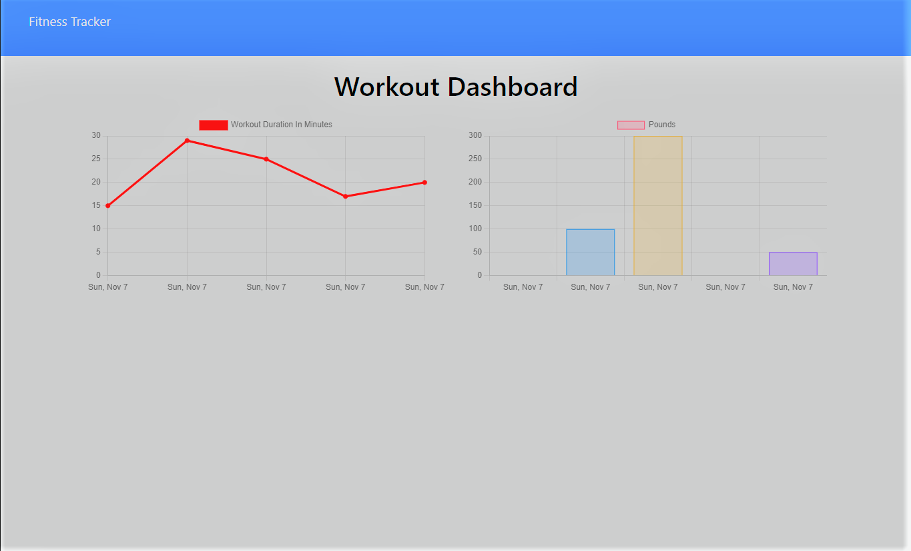

# Devins Fitness Tracker
Week 18 Homework 

## Description 

This is a simple app to keep track of workouts that have been completed or are in progress. Users have the ability to add new workouts and update ones in progress.

## User Story

```md
As a user, I want to be able to view create and track daily workouts. 
I want to be able to log multiple exercises in a workout on a given day. 
I should also be able to track the name, type, weight, sets, reps, and duration of exercise. 
If the exercise is a cardio exercise, I should be able to track my distance traveled.
```

## Business Context

A consumer will reach their fitness goals more quickly when they track their workout progress.

## Access to app

[Deployed Link](https://stormy-scrubland-48541.herokuapp.com/?id=6181e5997a3a06001668c47d)
[Repo Link](https://github.com/DMosca2021/dm_Workout_Tracker)

## Example of app

